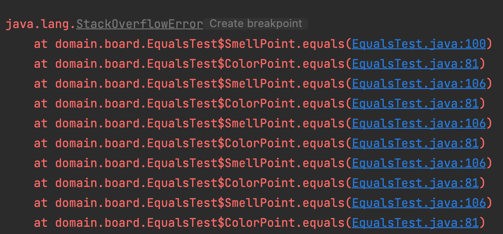

# equals는 일반 규약을 지켜 재정의하라


<br>

## equals 메서드
    equals 메서드는 인텔리제이 덕에 재정의 하기 쉽지만 곳곳에 함정이 도사리고 있어서 자칫하면 끔찍한 결과를 초래한다.


<br>


## 재정의 하지 않는 것이 최선인 경우

### 1. 각 인스턴스가 본질적으로 고유하다.
  - 값을 표현하는 게 아니라 동작하는 개체를 표현하는 클래스(Thread)

### Thread

``` java
@Override
public boolean equals(Object obj) {
    if (obj == this)
        return true;

    if (obj instanceof WeakClassKey) {
        Object referent = get();
        return (referent != null) && (referent == ((WeakClassKey) obj).get());
    } else {
        return false;
    }
}
```

### 2. 인스턴스의 '논리적 동치성'을 검사할 일이 없다.
- equals를 재정의하여 각 인스턴스가 같은 정규표현식을 나타내는지 검사할 수 있지만,
그럴 일이 없다면 굳이 재정의할 필요가 없다.(Pattern)

### Pattern

``` java
void patternTest() {
    final Pattern P1 = Pattern.compile("//.*");
    final Pattern P2 = Pattern.compile("//.*");

    System.out.println(P1.equals(P1)); // true
    System.out.println(P1.equals(P2)); // false
    System.out.println(P1.pattern()); // //.*
    System.out.println(P1.pattern().equals(P1.pattern())); // true
    System.out.println(P1.pattern().equals(P2.pattern())); // true
}
```

### 3. 상위 클래스에서 재정의한 equals가 하위 클래스에도 딱 들어맞는다.

- Set의 구현체들은 모두 AbstractSet이 구현한 equals를 상속 받아서 쓴다.
그 이유는 서로 같은 Set인지 구분하기 위해서 사이즈, 내부 값들을 비교하면 되기 때문이다.

``` java
public boolean equals(Object o) {
    if (o == this)
        return true;

    if (!(o instanceof Set))
        return false;
    Collection<?> c = (Collection<?>) o;
    if (c.size() != size())
        return false;
    try {
        return containsAll(c);
    } catch (ClassCastException | NullPointerException unused) {
        return false;
    }
}
```

그런데 그로 인해서 이런 일도 생긴다.

``` java
void setTest() {
    Set<String> hash = new HashSet<>();
    Set<String> tree = new TreeSet<>();
    hash.add("Set");
    tree.add("Set");

    System.out.println(hash.equals(tree)) // true;
}
```

### 4. 클래스가 private이거나 package-private이고 equals 메서드를 호출할 일이 없다.

``` java
@Override 
public boolean equals(Object o){
    throw new AssertionError(); // 호출 금지
}
```

<br>

## 언제 equals를 재정의 할까?

    equals는 논리적인 동치성을 확인하고 싶을 때 재정의 한다.

    예외
    Enum: 값 클래스라고 해도 값이 같은 인스턴스가 둘 이상 만들어지지 않음을 보장할때


<br>


## equals의 일반 규약
null이 아닌 모든 참조 값 x, y, z에 대해,
- 반사성: 
  - x.equals(x) == true
- 대칭성: 
  - x.equals(y) ==  true 
  - ->  y.equals(x) == true
- 추이성: 
  - x.equals(y) == true 
  - ->  y.equals(z) == true 
  - ->  x.equals(z) == true
- 일관성: 
  - x.equals(y)를 반복해도 값이 변하지 않는다.
- null-아님: 
  - x.equals(null) == false


## 어렵지만 지켜야한다.

    존 던(John Donne)의 말처럼 세상에 홀로 존재하는 클래스는 없기에, 
    협력 관계에서 수 많은 클래스는 자신에게 전달된 객체가 equals 규약을 지킨다고 가정하고 동작한다.


<br>


##  1. 반사성
- null이 아닌 모든 참조 값 x에 대해 x.equals(x)를 만족해야 한다.
- 자기 자신과 같아야 한다.


<br>


##  2. 대칭성
- null이 아닌 모든 참조 값 x, y에 대해 x.equals(y)가 true이면, y.equals(x)가 true를 만족해야 한다.
- 서로에 대한 동치 여부가 같아야 한다.

``` java
public final class CaseInsensitiveString {
    private final String s;
    
    public CaseInsensitiveString(String s) {
        this.s = Objects.requireNonNull(s);
    }
    
    @Override
    public boolean equals(Object o) {
    if(o instanceof CaseInsensitiveString) {
        return s.equalsIgnoreCase(((CaseInsensitiveString) o).s);
    }
    
    if(o instanceof String) { //한 방향으로만 작동!!
        return s.equalsIgnoreCase((String) o);
    }
    return false;
}

void symmetryTest() {
    CaseInsensitiveString caseInsensitiveString = new CaseInsensitiveString("Test");
    String test = "test";
    System.out.println(caseInsensitiveString.equals(test)); //true
    System.out.println(test.equals(caseInsensitiveString)); //false
}
```


<br>

## 3. 추이성

- null이 아닌 모든 참조 값 x, y, z에 대해 x.equals(y)가 true이고, 
y.equals(z)가 true이면 x.equals(z)도 true이다.

``` java
public class Point {
    private final int x;
    private final int y;
    
    public Point(int x, int y) {
        this.x = x;
        this.y = y;
    }
    
    @Override
    public boolean equals(Object o) {
    if(!(o instanceof Point)) return false;
        Point p = (Point) o;
        return this.x == p.x && this.y == p.y;
    }
}
```

``` java
public class ColorPoint extends Point {

    private final Color color;

    @Override
    public boolean equals(Object o) {
        if (!(o instanceof Point)) {
            return false;
        }

        //o가 일반 Point이면 색상을 무시햐고 x,y정보만 비교한다.
        if (!(o instanceof ColorPoint)) {
            return o.equals(this);
        }

        //o가 ColorPoint이면 색상까지 비교한다.
        return super.equals(o) && this.color == ((ColorPoint) o).color;
    }
}
```

``` java
void transitivityTest() {
    ColorPoint a = new ColorPoint(1, 2, Color.RED);
    Point b = new Point(1, 2);
    ColorPoint c = new ColorPoint(1, 2, Color.BLUE);

    System.out.println(a.equals(b)); //true
    System.out.println(b.equals(c)); //true
    System.out.println(a.equals(c)); //false
}
```

<br>

### 3-1. 추의성(무한 재귀)

``` java
public class SmellPoint extends Point {

    private final Smell smell;

    @Override
    public boolean equals(Object o) {
        if (!(o instanceof Point)) {
            return false;
        }

        //o가 일반 Point이면 색상을 무시햐고 x,y정보만 비교한다.
        if (!(o instanceof SmellPoint)) {
            return o.equals(this);
        }

        //o가 ColorPoint이면 색상까지 비교한다.
        return super.equals(o) && this.smell == ((SmellPoint) o).smell;
    }
}

void infinityTest() {
    Point cp = new ColorPoint(1, 2, Color.RED);
    Point sp = new SmellPoint(1, 2, Smell.SWEET);

    System.out.println(cp.equals(sp));
}
```


<br>

### 3-2. 추의성(리스코프 치환 원칙)

만약 추이성을 지키기 위해서 Point의 equals를 각 클래스들을 getClass를 통해서 
같은 구체 클래스일 경우에만 비교하도록 하면 어떨까?
``` java
@Override
public boolean equals(Object o) {
    if(o == null || o.getClass() != this.getClass()) {
        return false;
    }

    Point p = (Point) o;
    return this.x == p.x && this.y = p.y;
}
```

이렇게 되면 동작은 하지만, 리스코프 치환원칙을 지키지 못하게 된다. 

    이는 모든 객체 지향 언어의 동치관계에서 나타나는 근본적인 문제이며, 
    객체 지향적 추상화의 이점을 포기하지 않는 한 불가능하다.


<br>

### 3-3 추의성(상속 대신 컴포지션(아이템 18)을 사용해라)

[상속 대신 컴포지션을 사용해라(아이템 18) By 루키](https://github.com/woowacourse-study/2022-effective-java/blob/main/04%EC%9E%A5/%EC%95%84%EC%9D%B4%ED%85%9C18/%EC%95%84%EC%9D%B4%ED%85%9C18-%EC%83%81%EC%86%8D%EB%B3%B4%EB%8B%A4%EB%8A%94_%EC%BB%B4%ED%8F%AC%EC%A7%80%EC%85%98%EC%9D%84_%EC%82%AC%EC%9A%A9%ED%95%98%EB%9D%BC.md)

``` java
public class ColorPoint2 {
    private Point point;
    private Color color;

    public ColorPoint2(int x, int y, Color color) {
        this.point = new Point(x, y);
        this.color = Objects.requireNonNull(color);
    }

    public Point asPoint() {
        return this.point;
    }

    @Override
    public boolean equals(Object o) {
        if (!(o instanceof ColorPoint)) {
            return false;
        }
        ColorPoint cp = (ColorPoint) o;
        return this.point.equals(cp) && this.color.equals(cp.color);
    }
}
```

<br>

### 3-4 추의성(추상 클래스)

    추상 클레스의 하위 클래스에서라면 equals의 규약을 지키면서도 값을 추가할 수 있다.

[태그 달린 클래스보다는 클래스 계층구조를 활용하라(아이템 23) By 티키](https://github.com/woowacourse-study/2022-effective-java/blob/main/04%EC%9E%A5/%EC%95%84%EC%9D%B4%ED%85%9C_23/%ED%83%9C%EA%B7%B8_%EB%8B%AC%EB%A6%B0_%ED%81%B4%EB%9E%98%EC%8A%A4%EB%B3%B4%EB%8B%A4%EB%8A%94_%ED%81%B4%EB%9E%98%EC%8A%A4_%EA%B3%84%EC%B8%B5%EA%B5%AC%EC%A1%B0%EB%A5%BC_%ED%99%9C%EC%9A%A9%ED%95%98%EB%9D%BC.md)
이와 같은 구조에서는 상위 클래스를 직접 인스턴스로 만드는 것이 불가능 하기 때문에
지금까지 이야기한 문제들은 모두 일어나지 않는다.

<br>

## 4. 일관성

- null이 아닌 모든 참조 값 x, y에 대해, x.equals(y)를 반복해서 호출하면 항상 true를 반환하거나 항상 false를 반환한다.


``` java
@Test
void consistencyTest() throws MalformedURLException {
    URL url1 = new URL("www.xxx.com");
    URL url2 = new URL("www.xxx.com");

    System.out.println(url1.equals(url2)); //?
}
```

java.net.URL 클래스는 URL과 매핑된 host의 IP주소를 이용해 비교하기 때문에 같은
도메인 주소라도 나오는 IP정보가 달라질 수 있기 때문에 반복적으로 호출할 경우 결과가
달라질 수 있다. 

따라서 이런 문제를 피하려면 equals는 항시 메모리에 존재하는 객체만을 사용한
결정적 계산을 수행해야 한다.

<br>

## 5. null-아님

- null이 아닌 모든 참조 값 x에 대해, x.equals(null)은 false

`o.equals(null) == true`인 경우는 상상하기 어렵지만, 실수로 
`NullPointerException`을 던지는 코드 또한 허용하지 않는다.

이러한 `Exception`을 막기 위해서 여러가지 방법이 존재하는데, 그중 하나는 null인지 확인을 하고
`false`를 반환하는 것이다. 하지만 책에서는 다른 방법을 추천하고 있다.

``` java
@Override 
public boolean equals(Object o) {
    // 우리가 흔하게 인텔리제이를 통해서 생성하는 equals는 다음과 같다.
    if (o == null || getClass() != o.getClass()) {
        return false;
    }
    
    // 책에서 추천하는 내용은 null 검사를 할 필요 없이 instanceof를 이용하라는 것이다.
    // instanceof는 두번째 피연산자(Point)와 무관하게 첫번째 피연산자(o)거 null이면 false를 반환하기 때문이다. 
    if (!(o instanceof Point)) {
        return false;
    }
}

```

<br>

## equals 좋은 재정의 방법

``` java
@Override
public boolean equals(final Object o) {
    // 1. == 연산자를 사용해 입력이 자기 자신의 참조인지 확인한다.
    if (this == o) {
        return true;
    }

    // 2. instanceof 연산자로 입력이 올바른 타입인지 확인한다.
    if (!(o instanceof Point)) {
        return false;
    }

    // 3. 입력을 올바른 타입으로 형변환 한다.
    final Piece piece = (Piece) o;

    // 4. 입력 개체와 자기 자신의 대응되는 핵심 필드들이 모두 일치하는지 하나씩 검사한다.
    
    // float와 double을 제외한 기본 타입 필드는 ==를 사용한다.
    return this.x == p.x && this.y == p.y;
    
    // 필드가 참조 차입이라면 equals를 사용한다.
    return str1.equals(str2);
    
    // null 값을 정상 값으로 취급한다면 Objects.equals로 NullPointException을 예방하자.
    return Objects.equals(Object, Object);
}
```

<br>

## 마무리

- 꼭 필요한 경우가 아니라면 재정의하지 말자.
- 그래도 필요하다면 핵심필드를 빠짐 없이 비교하며 다섯 가지 규약을 지키자.
- 어떤 필드를 먼저 비교하느냐가 equals의 성능을 좌우하기도 한다. 최상의 성능을 바란다면 다를 가능성이
더 크거나 비교하는 비용이 더 싼 필드를 먼저 비교하자.
- 객체의 논리적 상태와 관련 없는 필드는 비교하면 안 된다.
- 핵심 필드로부터 파생되는 필드가 있다면 굳이 둘다 비교할 필요는 없다. 편한 쪽을 선택하자.
- [equals를 재정의할 땐 hashCode도 반드시 재정의하자(아이템 11) By 에덴](https://github.com/woowacourse-study/2022-effective-java/blob/main/03%EC%9E%A5/%EC%95%84%EC%9D%B4%ED%85%9C_11/equals%EB%A5%BC_%EC%9E%AC%EC%A0%95%EC%9D%98%ED%95%98%EB%A0%A4%EA%B1%B0%EB%93%A0_hashCode%EB%8F%84_%EC%9E%AC%EC%A0%95%EC%9D%98%ED%95%98%EB%9D%BC.md)
- equals의 매개변수 입력을 Object가 아닌 타입으로는 선언하지 말자.
  - [@Override 애너테이션을 일관되게 사용하라(아이템40) By 매트](https://github.com/woowacourse-study/2022-effective-java/blob/main/06%EC%9E%A5/%EC%95%84%EC%9D%B4%ED%85%9C_40/%40Override%20%EC%95%A0%EB%84%88%ED%85%8C%EC%9D%B4%EC%85%98%EC%9D%84%20%EC%9D%BC%EA%B4%80%EB%90%98%EA%B2%8C%20%EC%82%AC%EC%9A%A9%ED%95%98%EB%9D%BC.md)
  