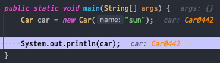
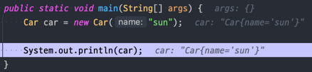

# toString을 항상 재정의하라

## toString을 재정의해야 하는 이유
- 작성한 클래스에 적합한 문자열을 반환하지 않음
- Car@515f550a와 같이 `클래스_이름@16진수로_표시한_해시코드`를 반환한다
- 간결하고 읽기 쉽지만 `name: sun`과 같이 객체의 정보를 직접 알려주는 형태가 훨씩 유익하다
- toString을 잘 구현한 클래스는 사용하기에 훨씬 즐겁고, 해당 클래스를 사용한 시스템은 디버깅에 용이하다
- 직접 호출하지 않더라도 println, 문자열 연결, assert 구문, 디버거의 객체 출력 등에서 자주 쓰인다
- map 객체의 경우 `{Jenny = PhoneNumber@addbb}`보다 `{Jenny = 012-1234-5678}`라는 메시지가 훨씬 가독성이 높다

### toString을 재정의하지 않은 예시


### toString을 재정의했다면?


## 어떻게 재정의해야 하는가?

### 간결하면서 사람이 읽기 쉬운 형태의 유익한 정보를 담아야 한다.
```
PhoneNumber@adbbd -> 012-1234-5678   
Car@442           -> Car{name=sun, position=2}
```

### 객체가 가진 주요 정보 모두를 반환하는게 좋다.
```java
class Address {
    private final String city;
    private final String gu;
    private final String dong;
    private final String detail;

    Address(String city, String gu, String dong, String detail) {
        this.city = city;
        this.gu = gu;
        this.dong = dong;
        this.detail = detail;
    }

    @Override
    public String toString() {
        return "Address{" +
                "city='" + city + '\'' +
                ", gu='" + gu + '\'' +
                '}';
    }
}
```
이런 식으로 일부만 반환하는 것은 좋은 방법이 아니다.
- 만약 객체가 거대하거나 객체의 상태가 문자열로 표현하기에 적합하지 않다면 요약정보를 담아야 한다. `ex) 맨해튼 거주자 전화번호부(총 1487536개)`

### toString을 구현할 때면 반환값의 포맷을 문서화할지 정해야 한다.
전화번호부나 행렬 같은 값 클래스라면 문서화를 권장한다. 포맷을 명시하면 객체는 표준적이고, 명확하고, 사람이 읽을 수 있게 된다.
```java
public String toString() {
    return String.format("%s-%s-%s", areaCode, prefix, lineNumber);
}
```

```
// 포맷 적용 전,
PhoneNumber{areaCode='02', prefix='512', lineNumber='1234'}

// 포맷 적용 후,
02-512-1234
```

다만 포맷 명시에도 단점이 있다.

- 포맷을 하면 읽기 편하고 좋지만, 포맷을 한번 명시하면 (그 클래스가 많이 쓰인다면) 평생 그 포맷에 얽매이게 된다. (수정이 어렵다)

- 반대로 포맷을 명시하지 않는다면 향후 릴리스에서 정보를 더 넣거나 포맷을 개선할 수 있는 유연성을 얻게 된다.

따라서 포맷 명시 여부와 상관없이 toString이 반환한 값에 포함된 정보를 얻어올 수 있는 `API를 제공해야 한다.` 접근자를 제공하지 않으면 이 정보가 필요한 프로그래머는 toString의 반환값을 파싱해야 하는데, 이는 성능을 떨어뜨림과 동시에 불필요한 작업이고, 향후 포맷을 바꾸면 시스템이 망가지는 결과를 초래할 수 있다. 

### toString을 재정의 하지 않아도 되는 경우
- 정적 유틸리티 클래스
- 이미 toString이 제공되는 Enum 타입

### 요약
포맷까지는 하지 않더라도 객체의 값에 관해 아무것도 알려주지 않는 Object의 toString보다는 toString의 자동 생성을 생활화 하자.  
`mac: cmd+opt+n에서 toString()`  
`windows: alt+ins에서 toString()`  