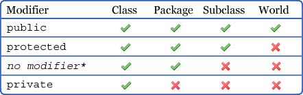
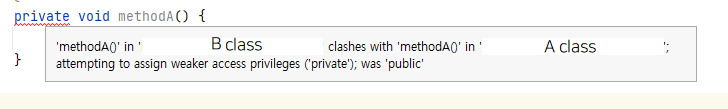
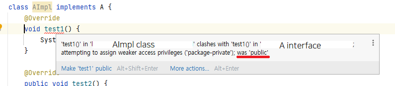

## 잘 설계된 컴포넌트
- 클래스 내부 데이터와 구현 정보를 외부로부터 잘 숨김
- 오직 API를 통해서 다른 컴포넌트와 소통 (서로 내부 동작 방식을 모름)

👉 `정보 은닉`, `캡슐화`가 중요

## 정보 은닉이란?
- : 다른 객체에게 자신의 정보를 숨기고 자신의 연산만을 통해 접근을 허용하는 것
- 여러 컴포넌트를 병렬로 개발 가능  
  👉 시스템 개발 속도↑
- 각 컴포넌트를 더 빨리 파악할 수 있고 교체 부담도 적음  
  👉 시스템 관리 비용 ↓
- 성능 최적화에 도움
- 소프트웨어의 재사용성 ↑

## 접근 제어자
Java는 이 정보 은닉을 위해 다양한 장치를 제공한다.  
`class`, `interface`, `member`는 접근 제어자를 통해 접근 허용 범위가 명시된다.  
기본적으로 모든 클래스와 멤버의 **접근성은 가능한 한 좁혀라**.

> member: 필드, 메소드, 중첩 클래스, 중첩 인터페이스, ...

<br>

### 톱 레벨 클래스, 인터페이스
> 톱 레벨: 가장 바깥이라는 뜻
- `package-private`(`default`): 해당 패키지 안에서만 이용 (=내부 구현)
- `public`: 공개 API (클라이언트에 영향)

#### 톱 레벨의 범위
`public`일 필요 없는 톱 레벨은 반드시 `package-private`으로 범위를 좁혀라.

#### 한 클래스에서만 사용하는 package-private
톱 레벨에 위치한다는 건 같은 패키지의 모든 클래스가 접근할 수 있다는 의미이다.  
이 때 `private static`을 중첩시키면 바깥 클래스 하나에서만 접근할 수 있다.  

```java
// AS-IS
public class A{
    private int a;
}
public class B{ // B가 A에서만 쓰이는 클래스라면?
    private int b;
}
```

```java
// TO-DO
public class A{
    private int a;
    
    private static class B{
        private int b;
    }
}
```
👉 한 클래스에서만 사용하는 `package-private` 톱레벨 클래스/인터페이스에서 고려해보자.(item 24)

<br>

### 멤버

- `private`: 해당 클래스에서만 접근 가능
- `package-private`: 클래스와 같은 패키지에서 접근 가능
- `protected`: 같은 패키지 + 하위 클래스의 패키지에서 접근 가능
- `public`: 모든 곳에서 접근 가능

#### 권한 풀어주기
권한을 풀어주는 일이 지나치게 많아지면 컴포넌트를 더 분리해야하는 것이 아닌지 고민해야 한다.

#### 멤버와 공개 API
`protected`와 `public`은 해당 클래스의 구현을 벗어나 공개 API에 영향을 줄 수 있다.  
내부 동작 방식을 API 문서에 적어 사용자에게 공개하는 경우도 생긴다. (item 19)  
`private`와 `package-private`는 내부 구현용이지만 예외적으로 Serializable을 직접 구현한 클래스에서는 공개 API가 될 수도 있다. (item 86, 87)

> Serialize; 직렬화  
> : Java 시스템 내부에서 사용되는 Object나 Data를 외부에서도 사용할 수 있도록 byte 형태로 변환하는 기술    
> Serializable 인터페이스를 상속받음으로써 객체는 직렬화의 조건을 충족함.

#### 멤버 접근성의 제약
리스코프 치환 원칙에 의해 상위 클래스의 메소드를 재정의하는 경우, 그 접근 수준을 상위 클래스보다 좁게 설정할 수 없다.  
이 규칙을 어기면 컴파일 오류가 발생한다.  
(class가 interface를 구현하는 건 특별한 예외로, class의 메소드는 모두 `public`으로 선언해야 한다.)

A 클래스를 상속받은 B
```java
public class A {
    public void methodA() {
        System.out.println("A!!");
    }
}

public class B extends A {
    @Override
    private void methodA() {
        System.out.println("B!!");
    }
}
```


A 인터페이스를 구현하는 AImpl

```java
interface A{
    void test1();
    public void test2();
}

class AImpl implements A {
    @Override
    void test1() {
        System.out.println("test1");
    }

    @Override
    public void test2() {
        System.out.println("test2");
    }
}
```


> 리스코프 치환 원칙이란?  
> 👉 상위 타입의 객체를 하위 타입의 객체로 치환해도 동작에 문제가 없어야하는 규칙

#### public 클래스의 인스턴스 필드
public 클래스의 인스턴스 필드가 `public`이면 필드가 언제든지 가변될 수 있다.  
그렇다면 `public final`으로 바꾸면 되지 않은가? 라고 생각할 수 있다.  
이 경우에는 배열이나 List의 경우를 값의 변경 여지가 있다는 점을 생각하면 될 것 같다.  
애초에 우리의 가장 큰 목적이었던 `캡슐화`에서 벗어나있기도 하다.

```java
public class A {
  public int[] arr = {1, 2, 3};
}

@Test
public void test() {
  A a = new A();
  a.arr[2] = 3;
  assertThat(a.arr[2]).isNotEqualTo(2);
}
```

예외로 꼭 필요한 경우 `static final` 상수를 `public`으로 지정할 수 있다.    
(배열이나 가변 List의 경우 값이 가변될 수 있으니 주의할 것.)

Array와 List 불변으로 return하기
```
// 배열
Collections.unmodifiableList(Arrays.asList(배열));
배열.clone();
```
```
// 리스트
Collections.unmodifiableList(리스트);
```

### 접근성

#### 테스트를 위한 접근성 확장
테스트 목적으로 접근 범위를 넓히는 경우가 있다.  
`private` 멤버를 `default`로 풀어주는 정도까지는 괜찮지만 이를 `protected`, `public`까지 푸는 것은 문제가 있다.  
이러한 경우 테스트 목적은 무엇인지, 클래스 구조나 설계가 잘못되어있지 않은지 의심해보아야 한다.

#### Java 9와 모듈 시스템
Java 9에서는 모듈 시스템이라는 개념이 도입되었다.
모듈은 패키지의 모음 같은 것인데 모듈에 속하는 패키지 중 공개(export)할 것을 선언하는 파일이 생성되었다. _(info.java)_  
이 파일에 존재하지 않는 패키지라면 `public`, `protected` 멤버라도 모듈 외부에서 접근이 불가능하다.  
다른 모듈에서는 접근할 수 없으나 같은 모듈이라면 패키지가 달라도 접근할 수 있는 접근 제어자가 생긴 것이다.  
> ex: JDK.  
> 자바 라이브러리에서 공개하지 않은 패지키들은 해당 모듈 밖에서 접근이 불가능함

> ❓ 모듈 시스템이 없던 시절의 코드는?  
JAR가 모듈 경로가 아닌 classpath에 로드된 것을 이름 없는 모듈(Unnamed Module)이라고 한다.  
모듈 공개 여부와 상관 없이 public, protected가 모듈 밖에서도 접근이 가능하다.  
모듈이 없는 것처럼 동작한다는 의미인데 이전에 작성되었던 Java 코드와의 하위 호환성을 유지하기 위함이다.

## 결론
접근성은 가능한 한 최소화 하자!

***
참고
1. Effective Java - item 15
2. https://www.geeksforgeeks.org/unnamed-module-in-java/