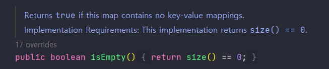

## 상속을 고려해 설계하고 문서화해라. 그러지 않았다면 상속을 금지하라.

### API 문서

상속은 코드 재사용을 쉽게 해주지만 잘못 사용하면 오류나기 쉽상이다.  
또한 메서드 호출과 달리 캡슐화를 깨뜨린다.  
상위 클래스의 변경이 하위 클래스까지 영향을 줄 수 있기 때문이다.

상속용 클래스는 **재정의 가능한 메서드**들을 내부적으로 어떻게 이용하는지, 어떠한 상황에서 호출할 수 있는지 등을 **문서**로 남겨야 한다.

> 좋은 API 문서  
> 본래 좋은 API 문서라면 '어떻게'가 아니라 '무엇'을 설명하는 것이 좋다.  
> 하지만 상속은 캡슐화를 깨뜨리는 방식이라 어쩔 수 없다. (안전하게 상속하는 것이 우선!)

#### 메서드 주석

- `implementation Requirements`: 메서드 내부 동작 방식 설명
- 메서드 주석에 `@implSpec` 태그를 붙이면 자바독 도구가 생성해줌  
  (Java 8에 도입되고 Java 9부터 본격적으로 적용)

AbstractMap - isEmpty()

```java
/**
 * {@inheritDoc}
 *
 * @implSpec
 * This implementation returns {@code size() == 0}.
 */
public boolean isEmpty(){
    return size()==0;
}
```



### ❗ 상속 설계 시 hook을 주의하자.

- `훅`; `hook`: 클래스의 내부 동작 과정 중간에 끼어들 수 있는 코드
- 상속을 설계할 때는 훅을 잘 선별해 protected 메서드 형태로 공개
- 이 부분에 대해선 정확한 기준은 없고 잘 예측해야 함
- 직접 하위 클래스를 만들고 검증하는 과정이 필수적

example - AbstractList의 clear()

```java
public abstract class AbstractList<E> extends AbstractCollection<E> implements List<E> {
    /**
     * Removes all of the elements from this list (optional operation).
     * The list will be empty after this call returns.
     *
     * @implSpec
     * This implementation calls {@code removeRange(0, size())}.
     *
     * <p>Note that this implementation throws an
     * {@code UnsupportedOperationException} unless {@code remove(int
     * index)} or {@code removeRange(int fromIndex, int toIndex)} is
     * overridden.
     *
     * @throws UnsupportedOperationException if the {@code clear} operation
     *         is not supported by this list
     */
    public void clear() {
        removeRange(0, size());
    }

    /**
     * Removes from this list all of the elements whose index is between
     * {@code fromIndex}, inclusive, and {@code toIndex}, exclusive.
     * Shifts any succeeding elements to the left (reduces their index).
     * This call shortens the list by {@code (toIndex - fromIndex)} elements.
     * (If {@code toIndex==fromIndex}, this operation has no effect.)
     *
     * <p>This method is called by the {@code clear} operation on this list
     * and its subLists.  Overriding this method to take advantage of
     * the internals of the list implementation can <i>substantially</i>
     * improve the performance of the {@code clear} operation on this list
     * and its subLists.
     *
     * @implSpec
     * This implementation gets a list iterator positioned before
     * {@code fromIndex}, and repeatedly calls {@code ListIterator.next}
     * followed by {@code ListIterator.remove} until the entire range has
     * been removed.  <b>Note: if {@code ListIterator.remove} requires linear
     * time, this implementation requires quadratic time.</b>
     *
     * @param fromIndex index of first element to be removed
     * @param toIndex index after last element to be removed
     */
    protected void removeRange(int fromIndex, int toIndex) {
        ListIterator<E> it = listIterator(fromIndex);
        for (int i = 0, n = toIndex - fromIndex; i < n; i++) {
            it.next();
            it.remove();
        }
    }

    // ...
}
```

- `clear()`
    - `removeRange()`를 호출해 index 처음부터 끝까지 삭제
- `removeRange()`
    - `clear()`를 고성능으로 만들기 쉽게 하기 위해 제공
    - 해당 메서드가 없었다면 하위 클래스에서 clear 메서드 호출 시 성능이 느려지거나 새로 구현했어야 함

### ❗ 상속용 클래스의 생성자에서 재정의 가능한 메서드 호출 금지

상위 클래스의 생성자는 하위 클래스의 생성자보다 먼저 실행된다.  
결론적으로 하위 클래스에서 재정의한 메서드가 하위 클래스의 생성자보다 먼저 호출되는 상황이 발생될 수 있다.

example - Class1을 상속하는 Class2

```java
class Class1 {
    public Class1() {
        test();
    }

    public void test() {
        System.out.println("test");
    }
}

class Class2 extends Class1 {
    private String string;

    public Class2() {
        string = "override!";
    }

    @Override
    public void test() {
        System.out.println(string);
    }
}
```

위에서 Class2의 test() 메서드를 호출하면 결과가 뭐로 나올까?  
일단 상위 클래스 생성자 선언 시 test()를 호출하니 System.out.println()은 2번 호출될 것이다.  
string에 `override!` 값을 넣어줬으니 이 값이 2번 나오리라 생각했지만 결과는 `null`과 `override!`였다.  
Class2의 생성자보다 Class2의 test()가 먼저 호출되었기 때문이다.

### ❓ Cloneable과 Serializable 인터페이스를 조심해라?

위 인터페이스를 구현한 클래스를 상속 가능하게 설계하는 것은 일반적으로 좋지 않다.  
`Cloneable`의 `clone()`과 `Serializable`의 `readObject()`는 새로운 객체를 만들어내는, 생성자와 비슷한 기능을 가졌다.  
클래스의 상태가 초기화되기 전에 메서드부터 호출되는 상황이 올 수 있다.

`Serializable`을 구현한 상속용 클래스가 `readResolve()`, `writeReplace()` 메서드를 가질 때 protected로 선언해야 한다.  
private으로 선언 시 하위 클래스에서는 무시된다.

### ❗ 상속을 금지하는 방법

1. 클래스를 final로 선언
2. 모든 생성자를 private나 default로 선언 뒤 public 정적 팩토리 생성

일반적인 구체 클래스가 상속을 금지하는건 사용이 불편해질 수 있다.  
이를 해결하기 위해서는 클래스 내부에서 재정의 가능 메서드를 사용하지 않게 만들고 이를 문서화하면 된다.  
메서드를 재정의해도 다른 메서드의 동작에 아무런 영향을 주지 않게끔 개발하면 된다.

### ❓ 상속에서 도우미 메서드 활용하기

클래스 동작을 유지하며 재정의 가능 메서드를 사용하는 코드를 제거하고 싶다면?  
재정의 가능 메서드를 private 형식의 도우미 메서드로 옮겨보자.

example - Class1을 상속하는 Class2 변형

```java
class Class1 {
    public Class1() {
        helper();
    }

    public void test() {
        helper();
    }

    private void helper() {
        System.out.println("test");
    }
}

class Class2 extends Class1 {
    private String string;

    public Class2() {
        string = "override!";
    }

    @Override
    public void test() {
        System.out.println(string);
    }
}
```