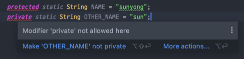

# 인터페이스는 타입을 정의하는 용도로만 사용하라

## 인터페이스란?
인터페이스는 자신을 구현한 클래스의 인스턴스를 참조할 수 있는 타입 역할을 한다. 즉, 자신의 인스턴스로 무엇을 할 수 있는지 클라이언트에 얘기해주는 것이다.

인터페이스는 오직 **이 용도로만** 사용되어야 한다.

## 인터페이스의 잘못된 사용

예시 )
```java
public interface BlackjackConstants {
    
    static final int BLACK_JACK_NUMBER = 21;
    
    static final int ALTERNATE_ACE_VALUE = 11;
    
    static final int DEALER_MIN_VALUE = 17;
}
```


실제 자바 플랫폼 라이브러리의 상수 인터페이스 )
```java
public interface ObjectStreamConstants {

    static final short STREAM_MAGIC = (short)0xaced;

    static final short STREAM_VERSION = 5;

    static final byte TC_BASE = 0x70;

    static final byte TC_NULL =         (byte)0x70;
    
    .
    .
    .
    
    public static final int PROTOCOL_VERSION_1 = 1;

    public static final int PROTOCOL_VERSION_2 = 2;
}
```

위 코드들은 상수 인터페이스로 static final 필드로만 이루어진 인터페이스이다. 위와 같은 상수 인터페이스는 안티패턴이며 인터페이스를 잘못 사용한 것이다.

## 상수 인터페이스 왜 쓰지 말아야 할까?
1. 사용하지 않을 수도 있는 상수를 포함하여 모두 가져오기 때문에 계속 가지고 있어야 한다.  


2. 클라이언트가 상수 인터페이스 값에 직접 접근할 수 있다. 이때, 불필요한 정보를 노출하는 것이 오히려 클라이언트에게 혼란을 야기할 수 있다.
   - 인터페이스에 private이나 protected를 사용할 수 없다
   - 클래스가 내부적으로 사용하는 상수들은 구현 세부사항인데, 모든 클래스에서 접근이 가능해 캡슐화를 깨뜨린다. 

    
3. 클래스가 어떤 상수 인터페이스를 사용하든 사용자에게는 아무런 의미가 없다.
   
4. 열거형 상수를 표현하기에 서툴다.
  - 의미없는 상수 `(0, 1, 2, 3)`가 사용됨
```java
public interface WeatherConstants { 
    int SUNNY = 0;
    int CLOUDY = 1;
    int RAINY = 2;
    int THUNDERSTORM = 3;
}
```
5. 바이너리 호환성을 위해 추후에 해당 상수들이 사용되지 않더라도 인터페이스를 구현해야 한다.

> 바이너리 호환성이란?  
> 클래스를 변경할 때 해당 클래스를 사용하는 클래스를 다시 컴파일할 필요가 없음을 의미한다.

```java
public class Logger implements Constants {
   public Logger getLogger(String name) {
         return LogManager.getLogger(name);
   }
}
```
다음과 같은 코드가 log-1.jar에 있다고 했을 때, 만약 log-2.jar 버전을 출시하면서 메서드를 변경하거나 삭제한다면, log-1.jar 사용자가 새 버전을 다운로드할 때 누락된 getLogger() 메서드 때문에 애플리케이션이 망가진다.

이는 상수형 인터페이스를 제거했을 때도 똑같이 바이너리 호환성을 무너뜨린다. 그러나 이 클래스의 private 또는 package-private 멤버는 외부 앱에서 사용할 수 없거나 사용하면 안되므로 바이너리 호환성을 위반하지 않고 제거나 변경이 가능하다.

[stackoverflow 링크](https://stackoverflow.com/questions/14973380/what-is-binary-compatibility-in-java)


### 마지막으로
인터페이스(interface)란 다른 클래스를 작성할 때 기본이 되는 틀을 제공하면서, 다른 클래스 사이의 중간 매개 역할을 담당하는 것인데 이를 상수를 위해 사용하는 것은 인터페이스를 올바르게 사용하는 것이 아니게 된다.
## 대안

### 클래스나 인터페이스 자체에 추가
Integer나 Double에 선언된 MIN_VALUE와 MAX_VALUE 상수
```java
public final class Integer extends Number
        implements Comparable<Integer>, Constable, ConstantDesc {
    
    @Native public static final int   MIN_VALUE = 0x80000000;
Integer
    
    @Native public static final int   MAX_VALUE = 0x7fffffff;
    
    ...

```
### 상수 유틸리티 클래스 제공
인스턴스화할 수 없는 유틸리티 클래스에 담아 공개 - 아이템 4
```java
public class BlackjackConstants {
    private BlackjackConstants() {
    }
    
    public static final int BLACKJACK_NUMBER = 21;
    public static final int ALTERNATE_ACE_VALUE = 11;
    public static final int DEALER_MIN_VALUE = 17;
}

public class BlackjackGame {
    public boolean isBust(int score) {
        return score > BLACKJACK_NUMBER;
    }
    
    public boolean shouldDealerDraw(int value) {
        return score < DEALER_MIN_VALUE;
    }
    ...
}
```

### Enum 활용
열거 타입으로 나타내기 적합한 상수라면 열거 타입으로 만들어 공개
```java
public enum PlayerResult {

    WIN("승"),
    DRAW("무"),
    LOSS("패"),
    ;

    private final String name;

    PlayerResult(final String name) {
        this.name = name;
    }
}
```

## 결론
인터페이스는 타입을 정의하는 용도로만 사용하고 상수 공개용 수단으로 사용하지 않아야 한다.
