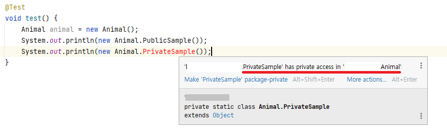
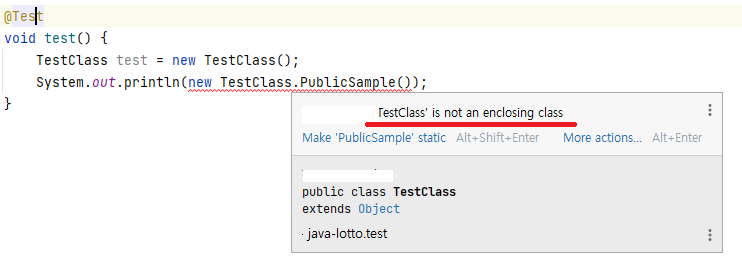

> 지난 번 [클래스와 멤버 접근 권한 최소화하기](../아이템_15/클래스와%20멤버%20접근권한%20최소화하기.md) 에서 한 클래스에서만 사용하는 클래스는 private static으로 중첩시키라는 말을 했습니다.  
> 오늘은 그 이유와 관련된 주제로 아이템을 선정했습니다.

## ❓ 중첩 클래스란?

- : 다른 클래스 안에 정의된 클래스
- 자신을 감싼 바깥 클래스에서만 사용되어야 함  
  (그 외 쓰임새가 생기면 톱 레벨 클래스로 생성)

#### 종류

- 정적 멤버 클래스
- 비정적 멤버 클래스
- 익명 클래스
- 지역 클래스

정적 멤버 클래스를 제외한 클래스들은 내부 클래스(inner class)라고 한다.

#### 중첩 클래스는 왜 사용해야 할까?

이제부터 알아보도록 하자😏

### 📕 정적 멤버 클래스

- class 내부에 static으로 선언된 클래스
- 바깥 클래스의 private 멤버에도 접근 가능
- private로 선언 시 바깥 클래스에서만 접근 가능

```java
public class Animal {
    private String name = "cat";

    // 열거 타입도 암시적 static
    public enum Kinds {
        MAMMALS, BIRDS, FISH, REPTILES, INSECT
    }

    private static class PrivateSample {
        private int temp;

        public void method() {
            Animal outerClass = new Animal();
            System.out.println("private" + outerClass.name); // 바깥 클래스인 Animal의 private 멤버 접근
        }
    }

    public static class PublicSample {
        private int temp;

        public void method() {
            Animal outerClass = new Animal();
            System.out.println("public" + outerClass.name); // 바깥 클래스인 Animal의 private 멤버 접근
        }
    }
}
```



#### 언제 사용할까?

- 👉 바깥 클래스가 표현하는 객체의 한 부분(구성요소)일 때 사용
- example: Map의 Entry
    - Map과 연관
    - Entry의 getKey(), getValue() 등의 메소드를 직접 사용 X

> Map 안의 Entry는 interface다.  
> Map을 구현하는 구현체인 HashMap에서 해당 interface를 implements하여 새로운 클래스를 정의한다.  
> 자세한 로직이 궁금하다면 `static class Node<K,V> implements Map.Entry<K,V>`를 찾아보아라.

### 📒 비정적 멤버 클래스

- static이 붙지 않은 멤버 클래스
- 비정적 멤버 클래스의 인스턴스 메서드에서 `클래스명.this`를 사용해 바깥 인스턴스의 메서드나 참조 가져올 수 있음
- 바깥 인스턴스 없이는 생성 불가  
  (👉 비정적 멤버 클래스의 인스턴스는 바깥 클래스의 인스턴스와 암묵적인 연결)

```java
public class TestClass {
    private String name = "yeonlog";

    public class PublicSample {
        public void printName() {
            // 바깥 클래스의 private 멤버 가져오기
            System.out.println(name);
        }

        public void callTestClassMethod() {
            // 바깥 클래스의 메소드 호출하기
            TestClass.this.testMethod();
        }
    }

    public PublicSample createPublicSample() {
        return new PublicSample();
    }

    public void testMethod() {
        System.out.println("hello world");
    }
}
```



- 바깥 클래스의 인스턴스 메서드에서 비정적 멤버 클래스의 생성자 호출
- `바깥 클래스 인스턴스.new 멤버클래스()` 호출
    - 위 두 방법으로 바깥 클래스 - 비정적 멤버 클래스의 관계 생성됨
    - 관계 정보는 비정적 멤버 클래스의 인스턴스 내에서 메모리 공간을 차지

```java
TestClass test = new TestClass();
PublicSample publicSample1 = test.createPublicSample(); // 바깥 클래스의 인스턴스 메서드에서 생성자 호출
PublicSample publicSample2 = test.new PublicSample(); // 바깥 인스턴스 클래스.new 멤버클래스()
```

#### 멤버 클래스에서 바깥 인스턴스에 접근할 일이 없다면 static을 붙이자.

- 바깥 인스턴스 - 멤버 클래스 관계를 위한 시간과 공간 소모
- Garbage Collection이 바깥 클래스의 인스턴스 수거 불가 -> 메모리 누수 발생
- 참조가 눈에 보이지 않아 개발이 어려움

#### 그럼 비정적 멤버 클래스는 언제 쓰는가?

👉 어댑터 정의 시 자주 쓰임.  
= 어떤 클래스의 인스턴스를 감싸서 다른 클래스의 인스턴스처럼 보이게 하는 뷰로 사용

example - Map 인터페이스의 구현체  
👉 `keySet()`, `entrySet()`, `values()`가 반환하는
자신의 [컬렉션 뷰](https://stackoverflow.com/questions/18902484/what-is-a-view-of-a-collection) 를 구현할 때 활용

```java
public class HashMap<K, V> extends AbstractMap<K, V>
        implements Map<K, V>, Cloneable, Serializable {

    final class EntrySet extends AbstractSet<Map.Entry<K, V>> {
        // size(), clear(), contains(), remove(), ...
    }

    final class KeySet extends AbstractSet<K> {
        // size(), clear(), contains(), remove(), ...
    }

    final class Values extends AbstractCollection<V> {
        // size(), clear(), contains(), remove(), ...
    }
}
```

### 📗 익명 클래스

- 이름이 없는 클래스
- 바깥 클래스의 멤버가 아님
- 쓰이는 시점에 선언 + 인스턴스 생성

#### 익명 클래스의 제약 사항

- 비정적인 문맥에서 사용될 때만 바깥 클래스의 인스턴스 참조 가능
  - static으로 선언된 메소드에서는 static만 접근이 가능하다.
- 정적 문맥에서 static final 상수 외의 정적 멤버 갖기 불가능
- 선언 지점에서만 인스턴스 생성 가능
- instanceof 검사 및 클래스 이름이 필요한 작업 수행 불가
  - 선언과 동시에 인스턴스 생성하고 더이상 사용하지 않음. 클래스 이름이 없음.
- 인터페이스 구현 및 다른 클래스의 상속 X
- 짧지 않으면 가독성 ↓

```java
public class Calculator {
    private int x;
    private int y;

    public Calculator(int x, int y) {
        this.x = x;
        this.y = y;
    }

    public int plus() {
        Operator operator = new Operator() {
            private static final String COMMENT = "더하기"; // 상수
            // private static int num = 10; // 상수 외의 정적 멤버는 불가능
          
            @Override
            public int plus() {
                // Calculator.plus()가 static이면 x, y 참조 불가
                return x + y;
            }
        };
        return operator.plus();
    }
}

interface Operator {
    int plus();
}
```

#### 언제 사용하는가?

- 즉석에서 작은 함수 객체나 처리 객체를 만드는 데 주로 사용  
  👉 람다 등장 이후로 람다가 이 역할을 대체
- 정적 팩터리 메소드 구현 시 사용

```java
List<Integer> list = Arrays.asList(10, 5, 6, 7, 1, 3, 4);

// 익명 클래스 사용
Collections.sort(list, new Comparator<Integer>() {
    @Override
    public int compare(Integer o1, Integer o2) {
        return Integer.compare(o1, o2);
    }
});

// 람다 도입 후
Collections.sort(list, Comparator.comparingInt(o -> o));
```

### 📘 지역 클래스

- 지역 변수를 선언할 수 있는 곳이면 어디서든 선언 가능
- 유효 범위는 지역 변수와 동일

#### 각 클래스와의 공통점

- `멤버 클래스`: 이름이 있고 반복해서 사용 가능
- `익명 클래스`: 비정적 문맥에서 사용될 때만 바깥 인스턴스 참조 가능
- `익명 클래스`: 정적 멤버를 가질 수 없음
- `익명 클래스`: 가독성을 위해 짧게 작성해야 함

```java
public class TestClass {
    private int number = 10;

    public TestClass() {
    }

    public void foo() {
        // 지역변수처럼 선언
        class LocalClass {
            private String name;
            // private static int staticNumber; // 정적 멤버 가질 수 없음

            public LocalClass(String name) {
                this.name = name;
            }

            public void print() {
                // 비정적 문맥에선 바깥 인스턴스를 참조 가능
                // foo()가 static이면 number에서 컴파일 에러
                System.out.println(number + name);
            }
        }
        LocalClass localClass1 = new LocalClass("local1"); // 이름이 있고
        LocalClass localClass2 = new LocalClass("local2"); // 반복해서 사용 가능
    }
}
```

## 💡 총정리

- 멤버 클래스: 메소드 밖에서 사용해야 하거나 너무 긴 경우
    - 정적: 바깥 인스턴스 참조 X
    - 비정적: 바깥 인스턴스 참조 O
- 익명 클래스: 한 메서드 안에서만 사용 + 인스턴스 생성 시점이 단 한 곳 + 해당 타입으로 쓰기 적합한 클래스나 인터페이스 이미 존재
- 지역 클래스: 그 외. (잘 쓰이지 않음)

***

### 참고

- Effective Java / 조슈아 블로크 / Chapter 4 - item 20
- https://jyami.tistory.com/86
- https://stackoverflow.com/questions/6223093/when-would-i-want-to-make-my-private-class-static
- 