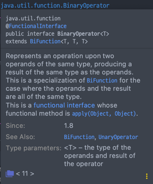
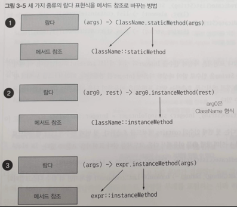

# 람다보다는 메서드 참조를 사용하라

## 메서드 참조
메서드를 참조해서 매개변수 리턴 타입을 알아내어 람다식의 불필요한 매개변수를 제거하는 방법

```java
import java.util.stream.Collectors;

public class Main {
    public static class Student {
        private String name;

        public Student(String name) {
            this.name = name;
        }

        public String getName() {
            return name;
        }
    }

    public static void main(String[] args) {
        List<Student> students = List.of(
                new Student("pobi"),
                new Student("jun"),
                new Student("woni"));

        String names;

        //일반 람다식
        names = students.stream().map(student -> student.getName()).collect(Collectors.joining(","));
        
        //메서드 참조 표현식
        names = students.stream().map(Student::getName).collect(Collectors.joining(","));
    }
}
```
람다식이 단 하나의 메소드만 호출할 경우에 해당 람다식에서 불필요한 매개변수를 없앨 수 있다. 이때 형식은 '`클래스명::메서드명`'의 형태로 써주면 간략한 메서드 참조로 변경할 수 있다.

Map 인터페이스의 다음과 같은 merge 메서드에서도 유용하게 사용 가능하다.
```java
default V merge(K key, V value,
            BiFunction<? super V, ? super V, ? extends V> remappingFunction)
```
해당 메서드는 key 값을 받아 
key가 map 안에 없다면 value 값을 (key, value) 쌍으로 저장하고
key가 map 안에 있다면 value 값을 BiFunction#apply 메서드에 적용한 다음, (key, BiFunction#apply 메서드의 결과) 쌍으로 저장한다.

BiFunction 인터페이스는 하나의 추상 메서드만 가지고 있는 함수형 인페이스이기 때문에 익명 클래스나 람다를 이용해 구현할 수 있다.

```java
// BiFunction 익명 클래스
map.merge(key, 1, new BiFunction<Integer, Integer, Integer>() {
    @Override
    public Integer apply(Integer oldValue, Integer value) {
        return oldValue + value;
    }
});

// BiFunction 람다
map.merge(key, 1, (oldValue, value) -> oldValue + value);
```

이때 BiFunction은 단순히 `oldValue + value`의 결과 값을 리턴해주기 때문에, 이와 동일한 기능을 하는 `Integer#sum` 메서드의 참조를 전달해 구현 가능하다. 위의 람다식처럼 작성하면 IDE에서 메서드 참조를 권고하는데, 이를 적용시키면 다음과 같다.
```java
// BiFunction 메서드 참조
map.merge(key, 1, Integer::sum);
```

이때 `Integer::sum` BiFunction에 들어갈 수 있는 이유는 해당 식이 BinaryOperator<Integer>로 변환되기 때문이며, BinaryOperator는 BiFunction을 상속받았기 때문이다.

 

## 항상 메서드 참조를 사용해야 할까?
메서드 참조를 사용하면 제거할 수 있는 코드양이 늘어나 더욱 간결하게 작성할 수 있지만, 람다의 매개변수 이름 자체가 프로그래머들이 코드를 이해하는데 좋은 가이드가 될 수 있어서 길이가 길더라도 코드 읽기가 좋아 유지보스에 용이하다.

예를 들어, 다음과 같은 코드가 있다고 치자.
```java
//메서드 참조 
service.execute(GoshThisClassNameIsHumongous::action);

//람다 사용
service.execute(() -> action());
```

메서드 참조를 사용했지만, 코드가 간결하지도 명확하지도 않다. 이럴 때는 람다(x -> x)를 직접 사용하는 것이 코드도 짧고 명확해진다.

## 메서드 참조 유형
메서드 참조에는 4가지 유형이 존재한다.

### 1. 정적 메서드
`Integer::parseInt`처럼 정적 메서드를 가리키는 메서드 참조

### 2. 비한정적(Unbound) 인스턴스 메서드
수신 객체를 특정하지 않고 적용하는 시점에 수신 객체를 알려준다. 즉, 이미 존재하는 외부 객체를 호출하는 상황을 일컫는다. 글의 맨 앞의 예시에서 사용한 것처럼 스트림 파이프라인에서의 매핑과 필터 함수에 쓰인다.

사용 방법: `클래스명::인스턴스 메서드`

ex) `student -> student.getName()` -> `Student::getName`

### 3. 한정적(bound) 인스턴스 메서드
정적 메서드 참조와 비슷하게 수신 객체를 특정한다. 람다의 파라미터 중 하나로 제공되는 객체의 메서드를 참조하는 것.  
사용 방법: `인스턴스::메서드명`  

ex) `(String str) -> s.length()` -> `str::length`

  
순차적으로 정적, 비한정적, 한정적 메서드 참조이다.

### 4. 클래스 생성자
클래스 생성자를 가리키는 메서드 참조
```java
Function<String, Student> function = Student::new;
Student student = funtion.apply("sun");
```

### 람다로 할 수 없다면 메서드 참조로도 할 수 없다
한 가지 예외.
람다로는 제네릭 함수타입 구현을 표현할 수 없다. 메서드 참조로만 가능하다.


## 결론
메서드 참조는 람다의 간단명료한 대안이다. 메서드 참조를 사용해 더 간결하고 명확한 의미를 나타낼 수 있다면 메서드 참조를 쓰고, 만약 그렇지 않다면 람다를 사용한다.

