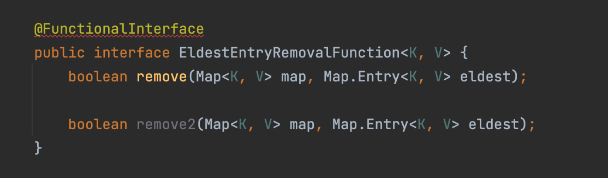

# 아이템 44 : 표준 함수형 인터페이스를 사용하라


## LinkedHashMap 예시

LinkedHashMap의 내부 구현 코드를 통해서 작동 방식부터 살펴보자.
``` java
final V putVal(int hash, K key, V value, boolean onlyIfAbsent,
                   boolean evict) {
   ...
   // HashMap의 Put 메서드에서 마지막에 afterNodeInsertion을 호출한다.
   afterNodeInsertion(evict);
}

void afterNodeInsertion(boolean evict) { // possibly remove eldest
    LinkedHashMap.Entry<K,V> first;
    // removeEldestEntry을 통해서 오래된 데이터를 지울 것인지에 대한 여부를 체크한다.
    if (evict && (first = head) != null && removeEldestEntry(first)) {
        K key = first.key;
        removeNode(hash(key), key, null, false, true);
    }
}

// LinkedHashMap 현재 내부 구현 : 항상 false를 리턴하고 있다. 
protected boolean removeEldestEntry(Map.Entry<K,V> eldest) {
    return false;
}
```

<br>

이렇게 구현되어 있는 LinkedHashMap을 removeEldestEntry를 통해서 캐시로 사용할 수 있다.
아래에 책에 소개 되어 있는 방법을 소개한다.

### Override

``` java
class OverrideLinkedHashMap extends LinkedHashMap<String, Integer> {

    private final int maxSize;

    OverrideLinkedHashMap(int maxSize) {
        this.maxSize = maxSize;
    }

    @Override
    protected boolean removeEldestEntry(Map.Entry<String, Integer> eldest) {
        return size() > maxSize;
    }
}

@Test
void Eldest_Entry_Removal_Override_Test() {
    OverrideLinkedHashMap overrideLinkedHashMap = new OverrideLinkedHashMap(1);
    overrideLinkedHashMap.put("1번", 1);
    overrideLinkedHashMap.put("2번", 2);

    assertThat(overrideLinkedHashMap.size()).isEqualTo(1);
    assertThat(overrideLinkedHashMap.get("1번")).isEqualTo(null);
}
```

### 함수형 인터페이스 직접 선언

``` java
@FunctionalInterface
public interface EldestEntryRemovalFunction<K, V> {
    boolean remove(Map<K, V> map, Map.Entry<K, V> eldest);
}

class InterFaceLinkedHashMap extends LinkedHashMap<String, Integer> {

    private final EldestEntryRemovalFunction<String, Integer> removalFunction;

    InterFaceLinkedHashMap(EldestEntryRemovalFunction<String, Integer> removalFunction) {
        this.removalFunction = removalFunction;
    }

    @Override
    protected boolean removeEldestEntry(Map.Entry<String, Integer> eldest) {
        return removalFunction.remove(this, eldest);
    }
}

@Test
void Eldest_Entry_Removal_Interface_Test() {
    InterFaceLinkedHashMap overrideLinkedHashMap = new InterFaceLinkedHashMap(
            (map, eldest) -> map.size() > 1
    );
    overrideLinkedHashMap.put("1번", 1);
    overrideLinkedHashMap.put("2번", 2);

    assertThat(overrideLinkedHashMap.size()).isEqualTo(1);
    assertThat(overrideLinkedHashMap.get("1번")).isEqualTo(null);
}
```

### 표준 인터페이스 사용

``` java
class BiPredicateLinkedHashMap extends LinkedHashMap<String, Integer> {

    private final BiPredicate<Map<String, Integer>, Map.Entry<String, Integer>> removalBiPredicate;

    BiPredicateLinkedHashMap(BiPredicate<Map<String, Integer>, Map.Entry<String, Integer>> removalBiPredicate) {
        this.removalBiPredicate = removalBiPredicate;
    }

    @Override
    protected boolean removeEldestEntry(Map.Entry<String, Integer> eldest) {
        return removalBiPredicate.test(this, eldest);
    }
}

@Test
void Eldest_Entry_Removal_BiPredicate_Test() {
    BiPredicateLinkedHashMap biPredicateLinkedHashMap = new BiPredicateLinkedHashMap(
            (map, eldest) -> map.size() > 1
    );
    biPredicateLinkedHashMap.put("1번", 1);
    biPredicateLinkedHashMap.put("2번", 2);

    assertThat(biPredicateLinkedHashMap.size()).isEqualTo(1);
    assertThat(biPredicateLinkedHashMap.get("1번")).isEqualTo(null);
}
```

<br>

## 표준 함수형 인터페이스

표준 함수형 인터페이스는 총 43개이며, 기본 인터페이스 6개를 통해서 나머지 부분을
유추할 수 있는 시스템이다.


### UnaryOperator (4개)

- 인수 타입, 반환 타입이 같다
- 인수 값이 1개이다.

| 인터페이스               | 메서드                                |
|---------------------|------------------------------------|
| UnaryOperator	      | T apply(T t)                       |
| IntUnaryOperator		  | int applyAsInt(int value)          |
| LongUnaryOperator   | long applyAsLong(long value)       |
| DoubleUnaryOperator | double applyAsDouble(double value) |


``` java
// 예시: String::toLowerCase
@Test
void UnaryOperator_Test() {
   UnaryOperator<String> unaryOperator = String::toLowerCase;
   assertThat(unaryOperator.apply("ABC")).isEqualTo("abc");
}
```


### BinaryOperator (4개)

- 인수 타입, 반환 타입이 같다
- 인수 값이 2개이다.


| 인터페이스                | 메서드                                               |
|----------------------|---------------------------------------------------|
| BinaryOperator	      | T apply(T t1, T t2)                               |
| IntBinaryOperator		  | int applyAsInt(int value1, int value2)            |
| LongBinaryOperator   | long applyAsLong(long value, long value2)         |
| DoubleBinaryOperator | double applyAsDouble(double value, double value2) |

``` java
// 예시: BigInteger::add
@Test
void BinaryOperator_Test() {
   BinaryOperator<BigInteger> binaryOperator = BigInteger::add;
   assertThat(binaryOperator.apply(BigInteger.ONE, BigInteger.TWO)).isEqualTo(BigInteger.valueOf(3L));
}
```

### Predicate (5개)

- 인수 값이 1개이며, boolean 반환한다.

| 인터페이스               | 메서드                        |
|---------------------|----------------------------|
| Predicate	          | boolean test(T t)          |
| BiPredicate<T, U>		 | boolean test(T t, U u)     |
| IntPredicate        | boolean test(int value)    |
| LongPredicate       | boolean test(long value)   |
| DoublePredicate     | boolean test(double value) |


``` java
// 예시: Collection::isEmpty
@Test
void Predicate_Test() {
   Predicate<Collection> predicate = Collection::isEmpty;
   assertThat(predicate.test(new ArrayList<>())).isTrue();
}
```

### Function (17개)

- 인수 타입과 반환 타입이 다르다.

| 인터페이스                | 메서드                  |
|----------------------|----------------------|
| Function<T, R>	      | R apply(T t)         |
| BiConsumer<T, U, R>	 | R apply(T t, U u)    |
| PFunction            | R apply(p value)     |
| PtoQFunction         | q applyAsQ(p value)  |
| ToPFunction          | p applyAsP(T t)      |
| ToPBiFunction<T, U>	 | p applyAsP(T t, U u) |

(P, Q 는 기본 자료형(Primitive Type) : Int, Long, Double)


``` java
// 예시: Arrays::asList
@Test
void Function_Test() {
     Function<int[], List> function = Arrays::asList;
     int[] array = {1, 2};
     List<Integer> list = function.apply(array);
     assertThat(function.apply(array).size()).isEqualTo(2);
}
```

### Supplier (5개)
- 예시: Instant::now
- 인수가 필요하지 않고, 반환이 있다.

| 인터페이스           | 메서드                    |
|-----------------|------------------------|
| Supplier        | T get()                |
| BooleanSupplier | boolean getAsBoolean() |
| IntSupplier     | int getAsInt()         |
| LongSupplier    | long getAsLong()       |
| DoubleSupplier  | double getAsDouble()   |

``` java
// 예시: Instant::now
@Test
void Function_Test() {
     Supplier supplier = Instant::now;
     supplier.get();
}
```

### Consumer (8개)
- 예시: System.out::println
- 인수가 필요하고, 반환이 없다.


| 인터페이스             | 메서드                            |
|-------------------|--------------------------------|
| Consumer          | void accept(T t)               |
| BiConsumer<T, U>  | void accept(T t, U u)          |
| IntConsumer       | void accept(int value)         |
| LongConsumer      | void accept(long value)        |
| DoubleConsumer    | void accept(double value)      |
| ObjIntConsumer    | void accept(T t, int value)    |
| ObjLongConsumer   | void accept(T t, long value)   |
| ObjDoubleConsumer | void accept(T t, double value) |

``` java
// 예시: System.out::println
void Function_Test() {
     Consumer consumer = System.out::println;
     consumer.accept("안녕");
}
```

<br>

## 커스텀 함수형 인터페이스


### 언제 구현하는가?
1. 표준 인터페이스 중 필요한 용도에 맞는 게 없을 때

``` java
@FunctionalInterface
public interface TriPredicate<A, B, C> {

   boolean test(A a, B b, C c);
}
```

2. 구조적으로 똑같은 표준 함수형 인터페이스가 있지만 다음 조건을 따를 경우
   1. 자주 쓰이며, 이름 자체가 용도를 명확히 설명해준다.
   2. 반드시 따라야 하는 규약이 있다.
   3. 유용한 디폴트 메서드를 제공할 수 있다.
   

``` java
@FunctionalInterface
public interface ToIntBiFunction<T, U> {

    int applyAsInt(T t, U u);
}

@FunctionalInterface
public interface Comparator<T> {
      
    // 반드시 따라야 하는 규약
    // Compares its two arguments for order. 
    // Returns a negative integer, zero, or a positive integer as 
    // the first argument is less than, equal to, or greater than the second.
    
    int compare(T o1, T o2);
    
    // 유용한 디폴트 메서드
    default Comparator<T> reversed() {
        return Collections.reverseOrder(this);
    }
}
```

### 주의사항

항상 @FunctionalInterface 애너테이션을 사용해야한다.

- 해당 클래스의 코드나 설명 문서를 읽을 이에게 그 인터페이스가 람다용으로 설계된 것임을 알려준다.
- 해당 인터페이스가 추상 메서드를 오직 하나만 가지고 있어야 컴파일되게 해준다.
- 유지보수 과정에서 누군가 실수로 메서드를 추가하지 못하게 막아준다.




<br>

## 마무리

보통의 경우에 `java.util.function` 패키지의 표준 함수형 인터페이스를 사용하는 것이 가장
좋은 선택이다. 하지만 특수한 경우에 새로운 함수형 인터페이스를 만들어 쓰는 것이 더 좋은 경우도 있다.

